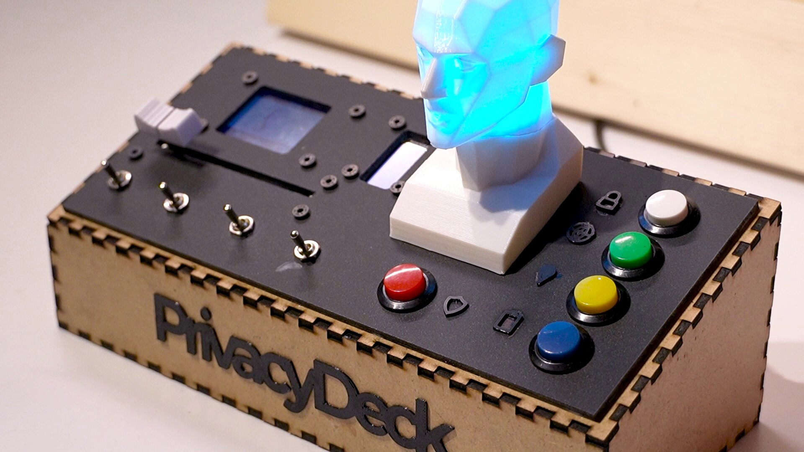
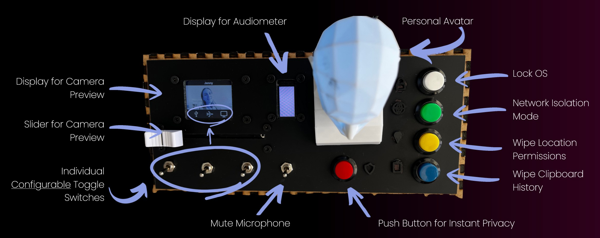
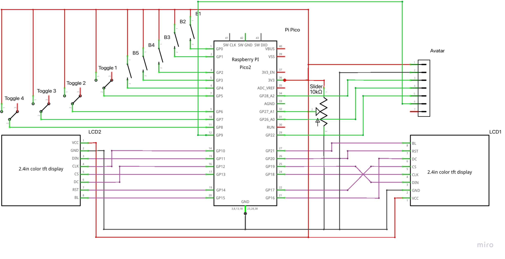
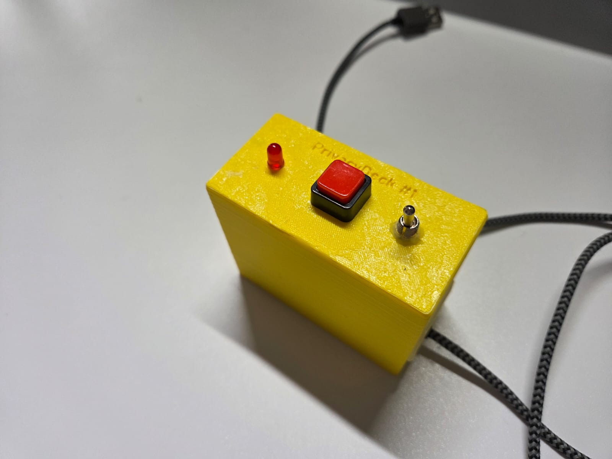
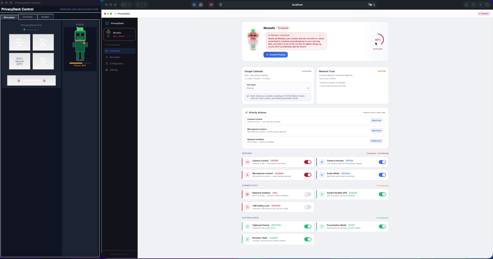

# PrivacyDeck

**Tangible Privacy Control. Zero Effort. Always Aware.**



*Built for the course **Practical Privacy and Security (PPS)** at LMU Munich*

---

## The Problem

Although privacy tools exist, they are buried deep inside complex, fragmented OS settings. There is **no unified control dashboard** and **no immediate feedback**.  
Most users therefore never enable protective features, preferring convenience over security — exposing themselves to risks such as unauthorized camera/microphone access, background data leaks, and embarrassing “always-on” moments.

## Our Vision

**PrivacyDeck envisions a world where privacy protection requires no effort.**  
Awareness alone is enough.  
No one ever has to worry about an embarrassing moment again.

---

## What is PrivacyDeck?

**PrivacyDeck** is a compact, USB-connected **physical control panel** that gives you **tangible, intuitive control** over all core privacy & security functions of your computer — at the press of a button or flip of a toggle.

- Personalized **avatar** on a small display that reflects your current privacy state via LEDs 
- Physical buttons, toggles & slider for instant action  
- Real-time visual & haptic feedback  
- Works with Linux (fully tested on Zorin OS), partially with Windows 11, and partially with macOS



---

## Repository Structure

```bash
PrivacyDeck/
├── verticalPrototype/                    # First working vertical prototype
├── 3d/                                   # All 3D-printable assets (avatar, etc.)
├── lasercut/                             # Laser-cut files for the case
│
├── privacyDeck/
│   ├── os/                               # Final OS-side daemon (Python)
│   │   └── final_main_os.py              # Main daemon – recommended on Linux
│   └── piPico/                           # Code for the Raspberry Pi Pico
│       └── final_main_pico.py            # Load as main.py on the Pico
│
└── guisoftware/                          # Graphical UI prototype (digital avatar + config)
```

---

## Hardware

- **Microcontroller**: Raspberry Pi Pico (RP2040)
- **Display**: Small TFT showing webcam and audio meter
- **Controls**: Buttons, toggles, slider, neopixel led
- **Connection**: Single USB cable (power + serial communication)



**Early vertical prototype:**



---

## Software

### 1. Raspberry Pi Pico (hardware side)
1. Copy `privacyDeck/piPico/final_main_pico.py` to the Pico as `main.py` and also include all other files
2. The Pico will automatically run and expose a serial port

### 2. Host OS Daemon (Linux / Windows)
1. `cd privacyDeck/os`
2. Make sure the serial port of the Pico is free
3. Run:
   ```bash
   python3 final_main_os.py
   ```
   (or `python final_main_os.py` on Windows)

**Tested & fully working on:**
- **Linux** – Zorin OS (primary development platform)
**Windows 11** – partially integrated (some triggers work with GUI solutions, full testing pending)
**macOS** – partially integrated (some triggers work, full testing pending)

### 3. GUI Software Prototype (optional but awesome)
Located in `guisoftware/`. Shows a beautiful digital avatar, live privacy status, and full configuration of every button/toggle.
Integration to the Python Daemon pending.



---

## How to Get Started (Quick Guide)

1. Laser-cut the enclosure (`lasercut/`)
2. 3D-print the avatar holder and details (`3d/`)
3. Flash the Pico with `final_main_pico.py`
4. Connect everything via USB
5. Run `final_main_os.py` on your computer
6. Enjoy instant, physical privacy control!

---

## Team

- **Franziska Oberländer**
- **Mustafa Durani**
- **Tristan Häuser**
- **Simon Rödig** 

---

**Course**  
Practical Privacy and Security (PPS)  
Ludwig-Maximilians-Universität München (LMU)  
Winter Semester 2025/26

---

**Made with ❤️ for privacy that finally feels effortless.**

```